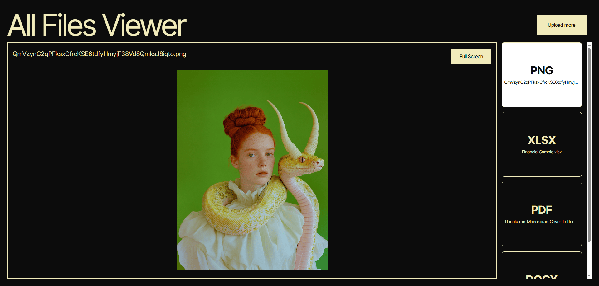

# All Files Viewer


## 📌 Overview

All Files Viewer is a web-based tool that allows users to view various file types directly in their browser without installing additional software. It provides a clean and user-friendly interface to open and inspect files such as text, code, json, images, and more.

Live Demo: [https://thinakaranmanokaran.github.io/All_Files_Viewer/](https://thinakaranmanokaran.github.io/All_Files_Viewer/)
Repository: [https://github.com/thinakaranmanokaran/All_Files_Viewer](https://github.com/thinakaranmanokaran/All_Files_Viewer)

---

## ✨ Features

* 📂 Upload and view different file formats
* 🖼 Supports images, text, JSON, code files, and other common types
* ⚡ Fast and responsive interface
* 📳 100% client-side — no backend or file uploads to servers
* 🧩 Works directly in the browser using HTML, JS, and CSS

---

## 🚀 How It Works

1. Open the application in your browser.
2. Upload a file from your device.
3. The viewer automatically detects the file type and displays it appropriately.
4. No internet or server upload required — everything is processed locally.

---

## 🧠 Tech Stack

* **HTML**
* **CSS**
* **JavaScript**
* Runs entirely client-side

---

## 🛠 Development & Build

### Clone the repository

```bash
https://github.com/thinakaranmanokaran/All_Files_Viewer.git
```

### No installation required

Simply open the `index.html` file in a browser.

---

## 📁 Project Structure

```
All_Files_Viewer
 ├── public/
 │   ├── preview.png
 │   ├── favicon512.png
 ├── index.html
 ├── script.js
 ├── style.css
 └── README.md
```

---

## 🧪 Browser Compatibility

* Chrome
* Firefox
* Edge
* Brave
* Safari

---

## 📸 Preview



---

## 👨‍💻 Author

**Thinakaran Manokaran**
Website: [https://thinakaran.dev/](https://thinakaran.dev/)

---

## ⭐ Contribute

Contributions are welcome!

* Fork the repository
* Create a new branch
* Submit a pull request

---

## 📄 License

This project is open-source and available under the MIT License.
